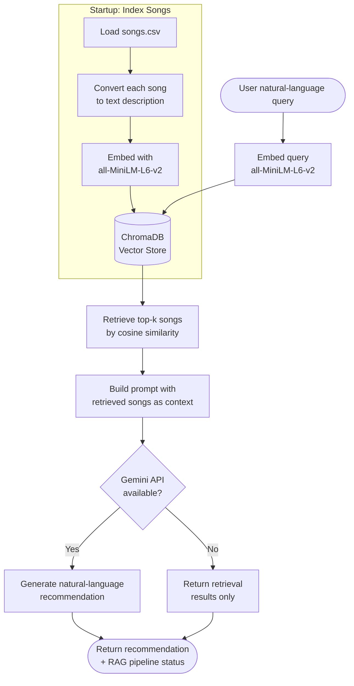
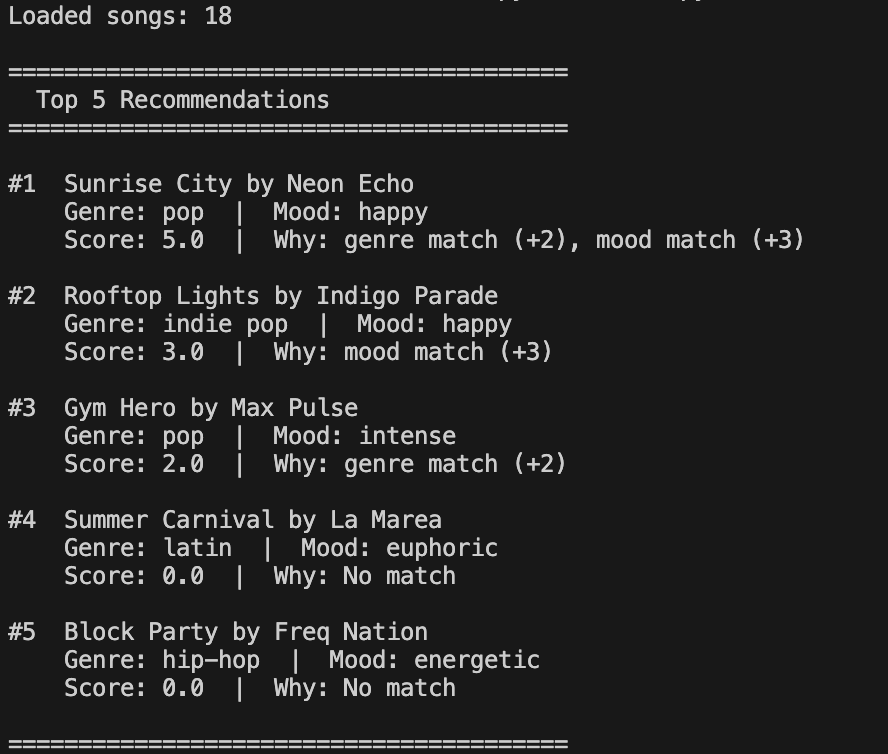
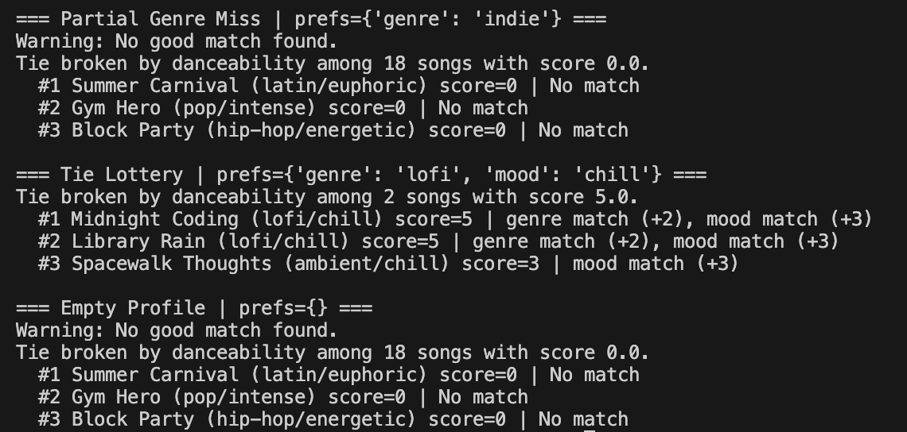
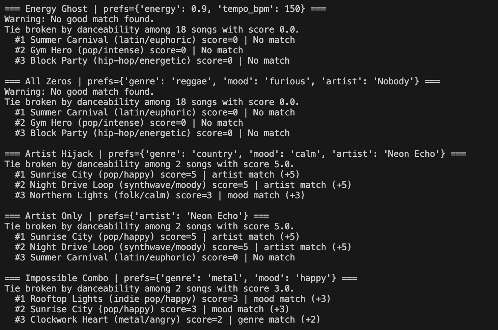

# 🎵 Music Recommender Simulation

## Project Summary

The project I chose to expand on was the music recommender system.

Previously, this project simulated a music recommender system using a catalog of 18 songs. Given a user's preferred genre, mood, and/or artist, the system scores every song and returns the top matches. Genre matches add 2 points, mood matches add 3, and artist matches add 5. Songs with equal scores are ranked by danceability as a tiebreaker. The goal is to explore how simple scoring rules can drive recommendations and where they fall short.

The goal of the expansion was to integrate Retrieval-Augmented-Generation(RAG) into the song fetching process.

---

## How The System Works

Looking at all the attributes in songs.csv, I want my recommender to prioritize mood and genre if the user isn't looking for a specific title or artist. I wouldn't worry too much about having the user input energy, tempo_bpm, valence, danceability or acousticness because those look like arbitrary numbers that I wouldn't be able to answer if someone asked me what song I was looking for.

To achieve my goal of integrating RAG, I used ChromaDB to store the data and a Google Gemini API Key to generate recommendations from the retrieved results.



The biases to be expected are exact string matching and having a small catalog, which can be fixed if more songs are added to it.


---

## Getting Started

### Setup

1. Create a virtual environment (optional but recommended):

   ```bash
   python -m venv .venv
   source .venv/bin/activate      # Mac or Linux
   .venv\Scripts\activate         # Windows

2. Install dependencies and Google API Key

Go to Google AI Studio and create a new project and key.

For Mac:
```bash
echo 'export GEMINI_API_KEY=your-key-here' >> ~/.zshrc
```

```bash
source ~/.zshrc
```

```bash
python -m pip install -r requirements.txt
```

3. Run the app:

```bash
python src/main.py
```

### Running Tests

Run the starter tests with:

```bash
pytest tests/ -v
```

---

## Limitations and Risks

## Edge cases



---

## Reflection

The most glaring limitation in my system is the amount of times it can run due to the quota that the free tier of Google Gemini API key has. The song database is also still pretty small because it doesn't scrape from the internet or anything it just uses the songs.csv file. I tried to prevent AI misuse by setting up the API key in the environment instead of hardcoding it into any of the files that would be public on GitHub. The AI suggestion of using ChromaDB was very helpful because it actually worked but the AI suggestion to use the Anthropic API key went off the assumption that I had the money to pay to use that service. I had to prompt again for a free version.

## Portfolio artifact
This project is a good starting point on my journey as an AI engineer. It gave me a chance to add RAG into a system that previously used exact string matching and returned a song list. Instead, the functionality evolved into semantic string recognition and passing the retrieved songs to Google Gemini as context instead of directly returning the song list.

## Github link
https://github.com/bt997/AppliedAiSystem

## Loom video link
https://www.loom.com/share/3e71d046978c4866932b602d37457c6a